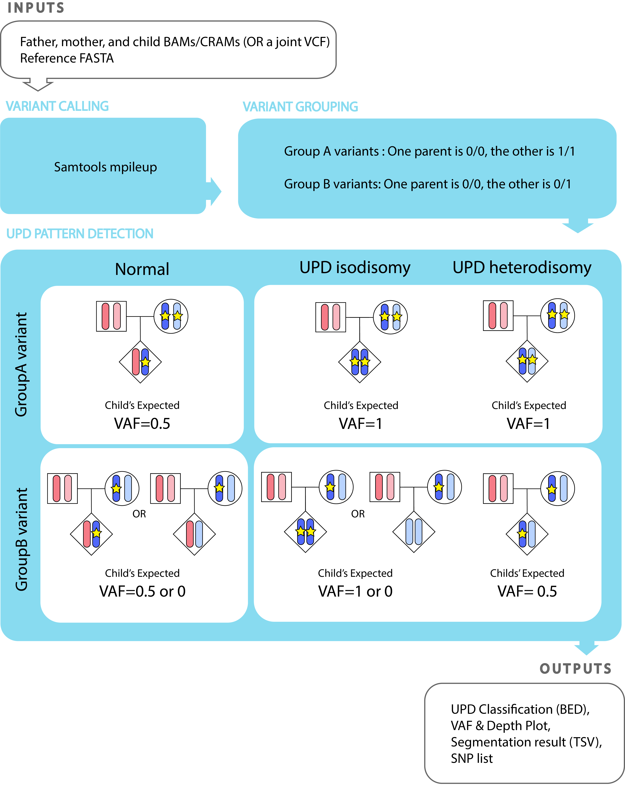

# TrioMix-upd
TrioMix-upd is a specialized version of [TrioMix](https://github.com/cjyoon/triomix), designed to detect uniparental disomy (UPD) from trio-based genomic sequencing data.  
It supports whole-exome sequencing (WES), whole-genome sequencing (WGS), and long-read sequencing (e.g., PacBio).

For details, please visit:  
https://triomix.readthedocs.io/en/latest/




## Workflow
TrioMix-upd identifies UPD by comparing a child’s variant allele fraction (VAF) to values expected under Mendelian inheritance.  
Informative SNPs are divided into two groups based on parental genotypes:

### **Group A**
- One parent is **0/0**, the other is **1/1**  
- Expected child VAF ≈ **0.5**  
- Strong deviations (e.g., ~0 or ~1) suggest possible **isodisomy**

### **Group B**
- One parent is **0/0**, the other is **0/1**  
- Expected child VAF is **0 or 0.5**, each with 50% probability  
- UPD shifts these expected patterns, producing distinct profiles for **heterodisomy** and **isodisomy**

These predictable VAF behaviors form the basis for segmentation and automated UPD classification.


## Usage

### Prerequisites

**Python (v3.5+)**
- `pysam`
- `pandas`

**R packages**
- `optparse`
- `tidyverse`
- `bbmle`
- `PSCBS`

### Install TrioMix-upd
```bash
git clone https://github.com/NahyunKong/triomix_upd.git
```

### Quick Start
Here's a basic command:

```bash
python3.10 triomix.py -f <father.bam> -m <mother.bam> -c <child.bam> -o <out_direcotry> -t 16 -r <reference.fa> -s <common_snps.bed.gz> --updMode
```

## Output
- `*.child.counts`  
  Lists every SNP used in the analysis and assigns it to GroupA and GroupB. 
  Read depth and alt-allele counts are provided for father, mother, and
  child. Using parental genotypes, the script also labels whether each allele
  in the child is maternally or paternally inherited. 

- `*.child.counts.upd.segments.tsv`  
  Segmented child's VAF profiles for GroupA and GroupB SNPs. For UPD classification is provided for each segments (e.g. maternal isodisomy / heterodisomy, paternal UPD, not_UPD).

- `*.counts.upd.classification.bed`  
  BED file summary of final UPD calls.  
  For each candidate UPD region (derived from GroupA segments), this file
  reports:
  - `chromosome`, `start`, `end`  
  - `UPD_final` (e.g. `maternal_isodisomy`, `maternal_heterodisomy`,
    `maternal_UPD`, `paternal_UPD`, `not_UPD`)  
  - `median_depth` of the region  
  This is a compact, genome-browser-friendly representation of the final UPD
  classification.

- `*.child.counts.plot.pdf`  
  Visualization of depth and VAF plots for GroupA and GroupB SNPs in the
  child, used to visually inspect UPD patterns.

## COMING SOON
- Specifialized function for detecting imprinitng disrupted regions within the UPD will be provided for Long-read data


